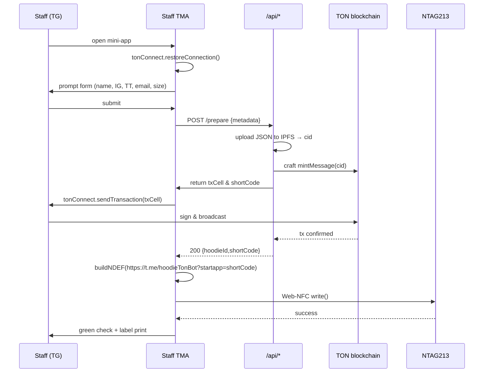
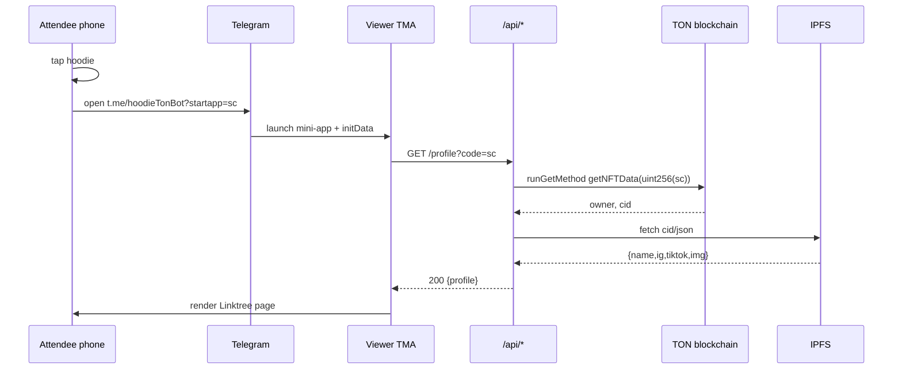

# Hoodie-TON  
NFC-enabled Telegram Mini-App that mints a TON blockchain record for every hoodie and serves a Linktree-style page on tap.

---

## 1. 30-second elevator pitch
Staff open the mini-app inside Telegram, fill in the wearer’s socials, mint a TON NFT (soul-bound), and write the unique `https://t.me/hoodieTonBot?startapp=<shortCode>` to an NTAG213 stitched in the hoodie.  
Attendee taps sleeve → Telegram opens → on-chain data is fetched → Linktree page rendered.

---

## 2. High-level architecture
```
┌---------------┐        HTTPS        ┌----------------┐
│  Staff TMA    │◀-----TON Connect───▶│  User Wallet   │
│  (React)      │                     │   (TON)        │
└-------┬-------┘                     └----------------┘
        │ write NFT
        ▼
┌---------------┐        JSON         ┌----------------┐
│  Serverless   │◀--------------------▶│  TON RPC       │
│  API (Vercel) │   mint/retrieve     │  (toncenter)   │
└-------┬-------┘                     └----------------┘
        │ Web-NFC / USB
        ▼
┌---------------┐      13.56 MHz      ┌----------------┐
│  NTAG213      │◀-------NFC---------▶│  Phone         │
│  in hoodie    │                     │  (iOS/Android) │
└---------------┘                     └----------------┘
```

---

## 3. Tech stack
| Layer | Tech |
|-------|------|
| Front-end (staff & viewer) | React 18 + Vite + @tma.js/sdk + Tailwind |
| Wallet bridge | TON Connect 2 |
| Blockchain | TON (soul-bound NFT) |
| Smart-contract | FunC, compiled with `func-js` |
| Metadata storage | IPFS via TON Storage gateway |
| NFC writer | Web-NFC (Android) or Node-Electron wrapper (Linux/Mac) |
| CI/CD | GitHub → Vercel (zero-config) |

---

## 4. Repository map
```
hoodie-ton/
├─ packages/
│  ├─ staff-tma/          # Telegram Mini-App for writers
│  ├─ viewer-tma/         # Public Linktree page
│  ├─ nfc-writer-electron/ # Desktop writer for iPad stations
│  ├─ smart-contract/     # FunC source + tests
│  └─ api/                # Vercel serverless functions
├─ README.md
└─ sequence-diagrams.md   # (this doc)
```

---

## 5. End-to-end flows

### 5.1 Mint & Write (staff)


### 5.2 Viewer tap (attendee)


---

## 6. API contract
### POST /prepare  
**Body**  
```json
{
  "firstName": "Alice",
  "lastInitial": "L",
  "ig": "alice_m",
  "tiktok": "alice_onTok",
  "email": "alice@example.com",
  "size": "M"
}
```
**Response 200**  
```json
{
  "shortCode": "a8x9k",
  "txCell": "te6ccgEBBAEABQ...",
  "hoodieId": 12345678
}
```

### GET /profile?code=a8x9k  
**Response 200**  
```json
{
  "name": "Alice L",
  "ig": "alice_m",
  "tiktok": "alice_onTok",
  "img": "https://ipfs.io/ipfs/bafybei..."
}
```

---

## 7. NFC implementation details
- **NDEF record**: URI identifier `0x04` (https://) + payload `t.me/hoodieTonBot?startapp=<shortCode>`  
- **Max URL length**: 59 bytes → fits NTAG213 (144 B) with 76 B to spare.  
- **Lock recommended**: set `LOCK_CTRL_TLV` after write to prevent re-write.  
- **Error handling**: if write fails, retry once; if still bad, discard sticker and re-print same shortCode on new tag.

---

## 8. Smart-contract excerpt (FunC)
```func
;; hoodie.fc
(int, slice) get_nft_data() method_id {
    slice ds = get_data().begin_parse();
    int hoodieId = ds~load_uint(128);
    slice ownerAddr = ds~load_msg_addr();
    slice contentSlice = ds~load_ref().begin_parse();
    return (hoodieId, contentSlice);
}
```
Compile & deploy with Blueprint:  
```bash
cd smart-contract
npm i
npx blueprint run deploy
```

---

## 9. Local development
```bash
git clone https://github.com/your-org/hoodie-ton
cd hoodie-ton
npm i
npm run dev:staff   # http://localhost:5173  (TMA stub)
npm run dev:viewer  # http://localhost:5174
npm run test:contract # Mocha + sandbox
```
**NFC on Linux**: plug ACR122U → `npm run nfc:write --code=a8x9k`

---

## 10. Production checklist
- [ ] Deploy smart-contract (mainnet) & top-up 5 TON  
- [ ] Set env vars (`TONCENTER_KEY`, `IPFS_KEY`, `TG_BOT_TOKEN`) in Vercel  
- [ ] Upload metadata template to IPFS once → pin  
- [ ] Register `@hoodieTonBot` with BotFather → set Mini-App URL  
- [ ] Print 200 NTAG213 stickers + 200 size labels  
- [ ] Burn-test 5 tags (write → lock → tap → verify)  
- [ ] Staff training video (2 min screen-cap)

---

## 11. Security & privacy
- No private keys stored server-side.  
- Email addresses kept off-chain (only in NFT metadata encrypted with event pubkey).  
- Short codes are base-36 of `hoodieId` → unguessable, enumerable only by owner.  
- Tags are read-only after write → attendee cannot repurpose.

---

## 12. Support & license
MIT © 2024 hoodie-ton contributors  
Issues / PR → GitHub  
Telegram dev chat → https://t.me/+abcd1234
