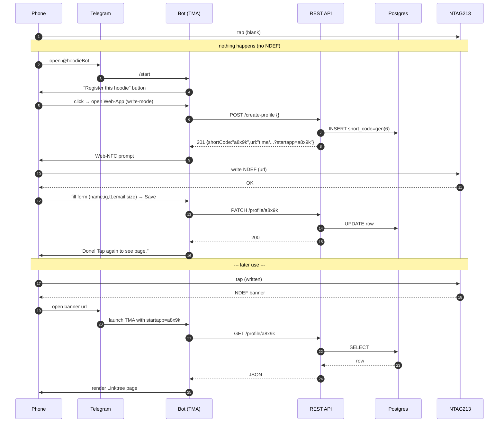

# Hoodie-NFC-Telegram  
Standalone README / spec sheet

## WHAT THIS IS
A Telegram Mini-App that turns an NTAG213 sticker sewn into a hoodie into a personal Linktree page.  
- First tap (tag blank) → forces registration inside Telegram.  
- Every later tap → opens the owner's Linktree page, still inside Telegram.

## SEQUENCE DIAGRAM


## ENDPOINTS
```
POST /create-profile  
→ 201 {shortCode, url}

PATCH /profile/<code>  
Body {firstName,ig,tiktok,email,size}

GET  /profile/<code>  
→ 200 {firstName,ig,tiktok,email,size}
```

## NFC RULES
- Blank tag = no NDEF → manual bot open.  
- Write only: `https://t.me/hoodieBot?startapp=<6-char-code>`  
- Lock tag after write (read-only).  
- 59-byte URL fits NTAG213 with room to spare.

## STACK
- Front-end: React + Vite + @tma.js/sdk  
- Back-end: Node serverless (Vercel)  
- DB: Postgres (shortCode PK)  
- NFC writer: Web-NFC (Android) or USB reader + Node CLI (Linux/Mac)

## DEPLOY
1. Create Telegram bot → set Mini-App URL  
2. Deploy API → set `DATABASE_URL`  
3. Build React bundle → upload to bot Web-App field  
4. Done.

## TEST WITHOUT A HOODIE
Stick NTAG213 on index card, use USB reader or Android Chrome to write, tap with iPhone → banner → Linktree page.

## COST
- NTAG213 stickers: ~$0.20 each  
- USB reader: ~$18 (optional)  
- Hosting: free tier Vercel + Neon Postgres

## LICENSE
MIT — do whatever you want.
