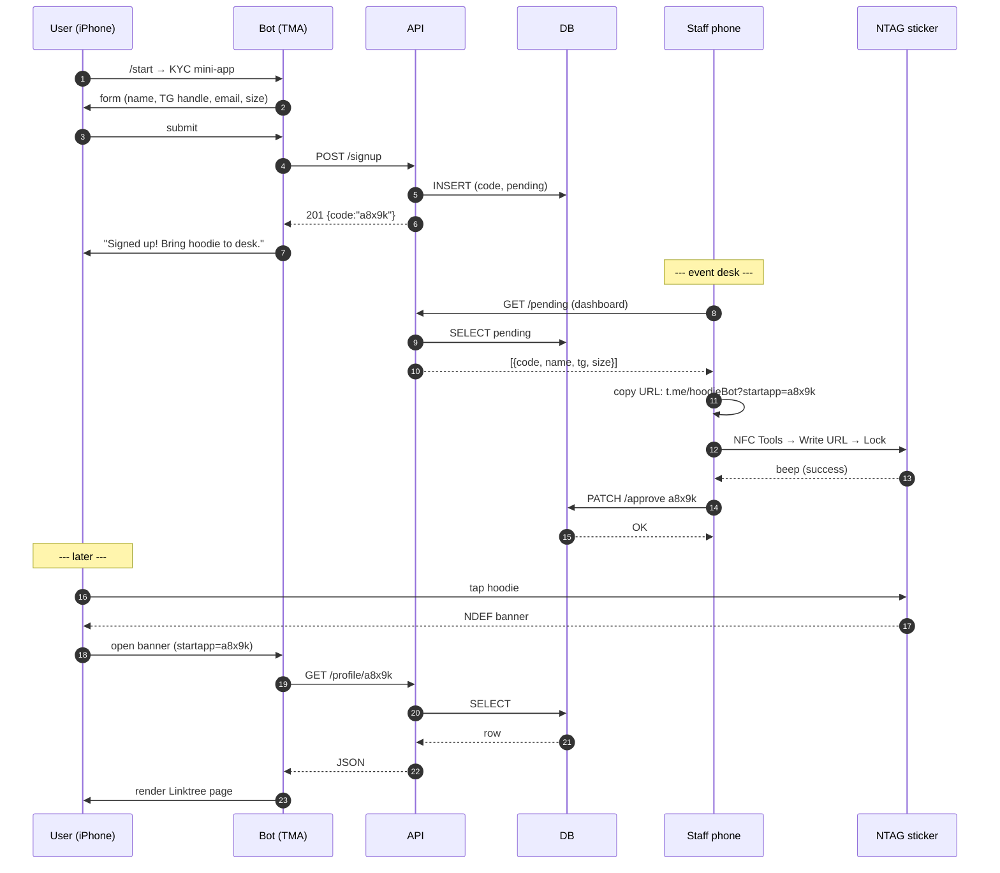

# Hoodie-NFC-Telegram  
**One-tap Linktree hoodies without code, wallets, or batteries.**

---

## 30-second pitch
1. Attendee opens **@hoodieBot** → fills KYC → gets queued.  
2. Staff copies short URL from dashboard → pastes into **NFC Tools** → burns to blank NTAG sticker → locks.  
3. Anyone taps hoodie → iPhone/Android banner → Telegram Mini-App opens → Linktree page.

---

## End-to-end flow



---

## Tech stack

| Layer | Tech |
| --- | --- |
| Bot runtime | Node 20 + TypeScript |
| TG framework | grammY (webhooks) |
| DB | Postgres (Neon free tier) |
| API / static | Vercel serverless |
| NFC write | NFC Tools app (iOS/Android) or optional Chrome PWA (Web-NFC) |
| Lock | NFC Tools “Lock” button after write |
| Deploy | `vercel` one-command |

---

## Folder map
```
hoodie-nfc-tg/
├── packages/
│   ├── bot/
│   │   ├── src/
│   │   │   ├── bot.ts          # webhook entry
│   │   │   ├── handlers/
│   │   │   │   ├── start.ts    # consumer KYC mini-app
│   │   │   │   ├── admin.ts    # /admin → dashboard button
│   │   │   │   └── viewer.ts   # startapp=code → viewer mini-app
│   │   └── static/
│   │       ├── consumer.html   # KYC form (TMA)
│   │       ├── admin.html      # staff dashboard (read-only TMA)
│   │       └── viewer.html     # Linktree page (TMA)
│   ├── api/
│   │   ├── signup.ts           # POST /signup
│   │   ├── approve.ts          # PATCH /approve
│   │   ├── profile/[code].ts   # GET  profile
│   │   └── pending.ts          # GET  pending codes (admin)
│   ├── writer/                 # optional Chrome PWA (Web-NFC)
│   │   └── index.html          # 1-click write + lock
│   └── db/
│       ├── schema.sql
│       └── seed.sql
├── vercel.json
├── .env.example
└── README.md
```

---

## Quick start (dev)

```bash
git clone https://github.com/your-org/hoodie-nfc-tg 
cd hoodie-nfc-tg
npm i
cp .env.example .env
# fill TG_BOT_TOKEN & DATABASE_URL
npm run dev          # local tunnel + hot reload
```

Deploy:
```bash
vercel --prod        # pushes bot + api + statics
```

---

## Environment variables
```
TG_BOT_TOKEN=700...:AAH...
DATABASE_URL=postgres://...
BOT_DOMAIN=https://hoodie-tg.vercel.app 
```

---

## DB schema
```sql
CREATE TABLE hoodies (
  code        CHAR(6) PRIMARY KEY,
  first_name  TEXT,
  tg_handle   TEXT,
  email       TEXT,
  size        TEXT,
  status      TEXT DEFAULT 'pending', -- pending | burned
  created_at  TIMESTAMPTZ DEFAULT NOW(),
  burned_at   TIMESTAMPTZ
);
```

---

## NFC how-to (staff cheat-sheet)
1. Open **dashboard** (link in `/admin` button).  
2. Hit **“Copy URL”** next to pending row.  
3. Open **NFC Tools** → **Write** → **Add record** → **URL** → **Paste** → **Write**.  
4. Touch blank **NTAG213** sticker → **OK**.  
5. Optional: **More** → **Lock tag** (prevents overwrite).  
6. Stick label (`a8x9k – @alice – M`) on bag.

---

## License
MIT
